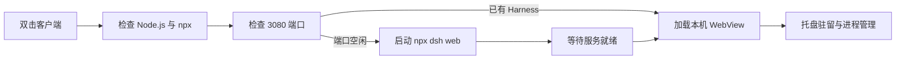

<p align="center">
  
</p>

<h1 align="center">DeepSeek Harness 桌面客户端</h1>

<p align="center">
  一个面向 Windows 的现代桌面外壳：双击启动、窗口内直接使用 DeepSeek Harness，并妥善管理后台进程。
</p>

<p align="center">
  
  
  
  
</p>

<p align="center">
  <a href="https://github.com/luoboovo/deepseek-harness-client/releases"><strong>下载 Windows 客户端</strong></a>
  ·
  <a href="./USAGE.md"><strong>查看完整操作指南</strong></a>
</p>

> [!NOTE]
> 这是一个桌面包装客户端。目标电脑仍需安装 Node.js LTS，客户端会在后台运行 `npx @deepseek-ai/dsh web`。

## 界面预览

DeepSeek Harness 会直接嵌入客户端窗口，无需跳转到系统浏览器。顶部状态栏用于查看服务状态、重启服务、打开日志以及管理窗口。


运行日志以侧边面板呈现；点击标题栏的日志按钮打开，再点击面板右上角红色 `×` 即可关闭。


## 功能亮点

- **窗口内直接使用**：通过 Electron `<webview>` 加载本机 `http://127.0.0.1:3080`。
- **自动启动服务**：启动客户端后检查 Node.js、npx 与端口状态，并按需启动 Harness。
- **进程妥善回收**：从托盘退出时，关闭由客户端创建的 npx/Node.js 进程树。
- **托盘后台运行**：关闭主窗口时隐藏到系统托盘，避免误停正在执行的任务。
- **清晰状态反馈**：提供启动、就绪、超时和异常状态，并保留最近的运行日志。
- **环境容错**：缺少 Node.js 或 npx 时显示错误提示和下载入口。
- **兼容现有服务**：如果 3080 端口已经运行 Harness，直接连接，不重复启动，也不会在退出时终止该外部进程。

## 快速开始

1. 安装 [Node.js LTS](https://nodejs.org/zh-cn/download)，并保留安装程序中添加到 `PATH` 的默认选项。
2. 从 [Releases](https://github.com/luoboovo/deepseek-harness-client/releases) 下载最新的 EXE。
3. 双击运行，等待顶部状态变为“DeepSeek Harness 已就绪”。

首次运行时，npx 可能需要联网下载 `@deepseek-ai/dsh`，所需时间会比后续启动更长。当前构建未进行商业代码签名，Windows SmartScreen 可能显示“未知发布者”；请确认文件来自本仓库 Releases 或由你自行构建。

完整的窗口操作、托盘退出、端口检查和故障排查步骤见 [操作指南](./USAGE.md)。

## 工作流程



## 从源码运行

```powershell
git clone https://github.com/luoboovo/deepseek-harness-client.git
cd deepseek-harness-client
npm install
npm start
```

## 构建 Windows 程序

构建免安装版：

```powershell
powershell -ExecutionPolicy Bypass -File .\scripts\build-portable.ps1
```

构建安装版：

```powershell
powershell -ExecutionPolicy Bypass -File .\scripts\build-installer.ps1
```

构建产物位于 `release` 目录。免安装版默认文件名为 `DeepSeekHarnessModern-1.0.0.exe`。

## 故障排查

<p align="center">
  
</p>

| 现象 | 优先检查 |
| --- | --- |
| 提示缺少 Node.js 或 npx | 在新 PowerShell 中运行 `node --version` 与 `npx --version` |
| 一直显示正在启动 | 打开日志面板，检查首次下载、网络或代理错误 |
| 3080 端口被占用 | 运行 `netstat -ano \| findstr :3080` 查找对应 PID |
| 页面空白或加载失败 | 重启服务，并确认 `127.0.0.1:3080` 正在监听 |
| 点击关闭后仍在运行 | 这是托盘模式；右键托盘图标并选择“退出” |

更完整的命令与处理方法见 [USAGE.md 的常见问题部分](./USAGE.md#9-常见问题)。

## 项目结构

```text
deepseek-harness-client/
├─ assets/        程序与托盘图标
├─ docs/images/   README、指南截图与角色插图
├─ scripts/       Windows 构建脚本
├─ src/           Electron 主进程、预加载与界面代码
├─ package.json   项目与打包配置
├─ README.md      项目主页
└─ USAGE.md       完整操作指南
```

## 说明

本项目是 DeepSeek Harness 的非官方桌面包装客户端。DeepSeek Harness 及相关名称归其各自权利人所有。
