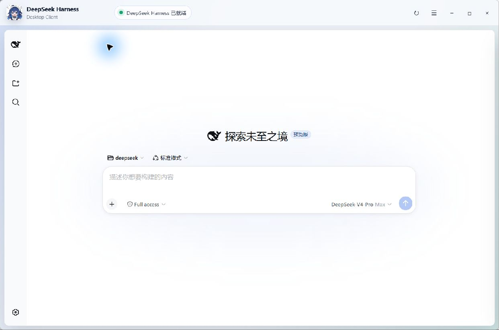
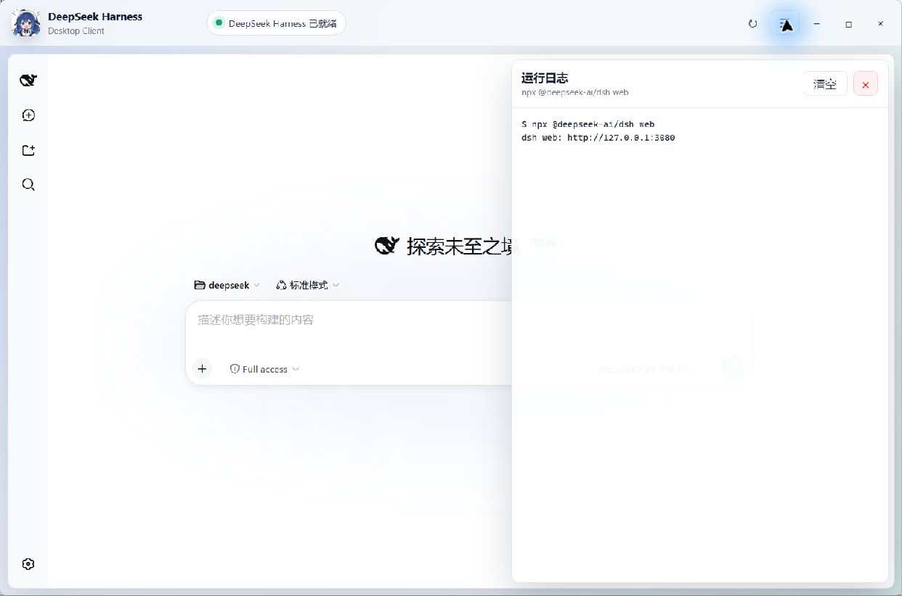
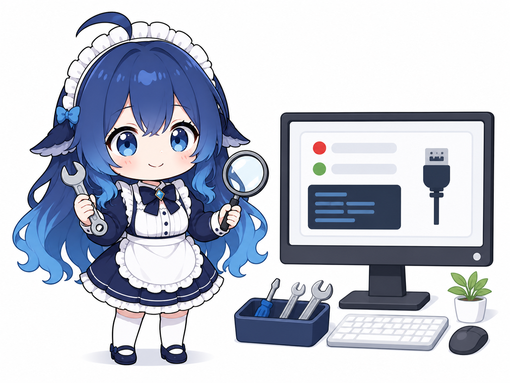

# DeepSeek Harness 桌面客户端操作指南

本文档适用于 `deepseek-harness-client` 的 Windows 版本，包含客户端使用、源码运行、打包和常见问题排查。

<p align="center">
  <a href="./README.md">返回项目主页</a>
  ·
  <a href="https://github.com/luoboovo/deepseek-harness-client/releases">下载最新版本</a>
  ·
  <a href="#9-常见问题">直接查看常见问题</a>
</p>

> [!TIP]
> 只想使用客户端：安装 Node.js LTS，从 Releases 下载 EXE，然后双击运行即可。第一次启动可能需要等待 npx 下载依赖。

## 目录

- [1. 客户端简介](#1-客户端简介)
- [2. 系统要求](#2-系统要求)
- [3. 普通用户使用方法](#3-普通用户使用方法)
- [4. 窗口与托盘操作](#4-窗口与托盘操作)
- [5. 查看运行日志](#5-查看运行日志)
- [6. 从源码运行](#6-从源码运行)
- [7. 打包 Windows 程序](#7-打包-windows-程序)
- [8. 3080 端口排查](#8-3080-端口排查)
- [9. 常见问题](#9-常见问题)
- [10. 数据与安全说明](#10-数据与安全说明)
- [11. 项目结构](#11-项目结构)
- [12. 完整卸载](#12-完整卸载)
- [13. Android 手机数据同步](#13-android-手机数据同步)

## 1. 客户端简介

客户端会在后台执行以下命令：

```powershell
npx @deepseek-ai/dsh web
```

DeepSeek Harness 启动后会监听本机 `http://127.0.0.1:3080`。客户端使用 Electron `<webview>` 在自己的窗口中显示该页面，不会把主界面跳转到系统浏览器。

主要功能：

- 双击客户端后自动检查并启动 DeepSeek Harness。
- 在桌面客户端内部显示 Harness 页面。
- 显示启动状态和实时运行日志。
- 支持重启后台服务。
- 关闭窗口时隐藏到系统托盘，避免误关后台进程。
- 从托盘退出时关闭本客户端启动的 Node.js/npx 进程树。
- 未安装 Node.js 或 npx 时显示错误提示和下载入口。
- 检测到 3080 端口已有服务时直接连接，不重复启动进程。
- 通过同一局域网让手机连接电脑上的 Harness API，同步会话、消息、任务与工作区数据。
- 生成二维码配对链接，Android 应用内可直接扫码，也可通过手机浏览器打开移动界面。



## 2. 系统要求

- Windows 10 或 Windows 11，64 位系统。
- Node.js LTS，安装包需包含 npm 和 npx。
- Android 客户端需要 Android 8.0（API 26）或更高版本。
- 首次启动时需要连接网络，以便 npx 下载或更新 `@deepseek-ai/dsh`。
- 本机 3080 端口可用，或该端口已经运行 DeepSeek Harness。

Node.js 下载地址：

<https://nodejs.org/zh-cn/download>

安装 Node.js 时建议保留“添加到 PATH”相关默认选项。安装结束后重新打开 PowerShell，再执行：

```powershell
node --version
npx --version
```

两条命令都能输出版本号，说明运行环境已准备好。

## 3. 普通用户使用方法

### 3.1 免安装版

1. 下载 `DeepSeekHarnessModern-Portable-1.3.1.exe`。
2. 确认电脑已安装 Node.js LTS。
3. 双击 EXE，等待状态栏显示“DeepSeek Harness 已启动”或“已就绪”。
4. 首次运行时 npx 可能需要下载依赖，等待时间会比后续启动更长。

免安装版可以放到任意有写入权限的目录中运行。

### 3.2 安装版

1. 双击 NSIS 安装包。
2. 根据向导选择安装目录。
3. 从桌面快捷方式或开始菜单打开 `DeepSeek Harness`。

当前构建未进行商业代码签名。Windows SmartScreen 可能显示未知发布者提示，请只运行从可信来源获取或自行构建的文件。

## 4. 窗口与托盘操作

标题栏右侧按钮：

- `↻`：重启 DeepSeek Harness。
- `☰`：打开或收起运行日志。
- `▯`：打开或收起手机数据同步面板。
- `−`：最小化窗口。
- `□`：最大化或还原窗口。
- `×`：隐藏到系统托盘，不会彻底退出程序。

日志面板：

- “清空”只清除当前窗口内显示的日志，不会停止服务。
- 红色 `×` 用于关闭日志面板。

系统托盘菜单：

- “打开窗口”：重新显示客户端。
- “重启 DeepSeek Harness”：重启客户端管理的后台服务。
- “退出”：彻底退出客户端，并关闭本客户端启动的 npx/Node.js 子进程。

注意：如果客户端启动前 3080 端口已经有服务，客户端会将它视为外部服务。退出客户端时不会杀掉这个外部进程。

## 5. 查看运行日志

点击标题栏的 `☰` 按钮打开日志面板。正常启动时一般可以看到：



```text
$ npx @deepseek-ai/dsh web
dsh web: http://127.0.0.1:3080
```

遇到启动失败、启动超时或页面空白时，先查看日志末尾的错误信息。常见关键词包括：

- `EADDRINUSE`：3080 端口被其他程序占用。
- `not recognized` 或“不是内部或外部命令”：Node.js/npx 未安装或 PATH 未生效。
- 网络或下载错误：npx 无法下载 `@deepseek-ai/dsh`。
- `code: 1`：后台命令异常退出，需要结合前面的日志判断原因。

## 6. 从源码运行

打开 PowerShell，进入项目目录：

```powershell
cd C:\path\to\deepseek-harness-client
```

安装依赖：

```powershell
npm install
```

启动开发版客户端：

```powershell
npm start
```

开发版与打包版使用相同的启动流程，都会检查 Node.js/npx、检查 3080 端口，并在需要时运行 DeepSeek Harness。

## 7. 打包 Windows 程序

所有打包产物默认生成在 `release` 目录。构建脚本会创建独立缓存目录，并配置 Electron 国内镜像。

### 7.1 打包免安装版

在项目根目录执行：

```powershell
powershell -ExecutionPolicy Bypass -File .\scripts\build-portable.ps1
```

输出文件：

```text
release\DeepSeekHarnessModern-Portable-1.3.1.exe
```

### 7.2 打包安装版

执行：

```powershell
powershell -ExecutionPolicy Bypass -File .\scripts\build-installer.ps1
```

安装包使用 NSIS，支持选择安装目录，并创建桌面和开始菜单快捷方式。

输出文件：

```text
release\DeepSeekHarnessModern-Setup-1.3.1.exe
```

### 7.3 打包 Android APK

```powershell
powershell -ExecutionPolicy Bypass -File .\scripts\build-android.ps1
```

脚本优先使用 Android Studio 自带 JDK；找不到时下载便携 JDK 17。首次构建还会准备 Gradle 8.13，并在本机忽略目录中生成发布签名密钥。

输出文件：

```text
release\DeepSeekHarnessMobile-1.3.1.apk
```

### 7.4 同时打包两种 Windows 版本

```powershell
$env:ELECTRON_MIRROR = "https://npmmirror.com/mirrors/electron/"
$env:ELECTRON_BUILDER_BINARIES_MIRROR = "https://npmmirror.com/mirrors/electron-builder-binaries/"
npm run dist:all
```

可用的 npm 命令：

```text
npm start            启动开发版
npm run dist         打包免安装版
npm run dist:installer  打包安装版
npm run dist:all     同时打包免安装版和安装版
```

## 8. 3080 端口排查

在 PowerShell 或命令提示符中执行：

```powershell
netstat -ano | findstr :3080
```

该命令用于查找正在使用 3080 端口的连接或监听进程。示例：

```text
TCP    127.0.0.1:3080    0.0.0.0:0    LISTENING    12345
```

最后一列 `12345` 是进程 PID。查看这个 PID 对应的程序：

```powershell
tasklist | findstr 12345
```

确认该进程可以关闭后，再执行：

```powershell
taskkill /PID 12345 /T /F
```

不要关闭不认识的系统进程。如果 3080 端口运行的正是可用的 DeepSeek Harness，可以直接打开客户端，客户端会连接现有服务。

关闭客户端后仍怀疑端口被占用，可以再次运行 `netstat` 命令确认。

## 9. 常见问题

<p align="center">
  
</p>

### 提示缺少 Node.js 或 npx

安装 Node.js LTS 后彻底退出客户端，再重新打开。如果已经安装，确认 `node --version` 和 `npx --version` 能在新打开的 PowerShell 中运行。

### 一直显示“正在启动”或“启动超时”

首次启动可能正在下载依赖。打开日志面板查看下载或网络错误，也可以在 PowerShell 中手动测试：

```powershell
npx --yes @deepseek-ai/dsh web
```

手动命令启动成功后按 `Ctrl+C` 停止，再重新打开客户端。

### 显示“3080 端口被占用”

使用第 8 节的 `netstat` 和 `tasklist` 命令确认占用者。如果是残留 Node.js 进程，在确认 PID 后使用 `taskkill` 关闭。

### 客户端页面空白或加载失败

1. 点击标题栏的重启按钮。
2. 打开运行日志，确认后台命令没有退出。
3. 用 `netstat -ano | findstr :3080` 检查端口是否监听。
4. 暂时关闭代理或检查防火墙是否阻止本机回环连接。

### 点击窗口关闭按钮后程序还在运行

这是预期行为。窗口右上角 `×` 会隐藏到托盘。需要彻底退出时，右键系统托盘中的客户端图标，然后点击“退出”。

### 为什么目标电脑仍要安装 Node.js

当前 EXE 只打包桌面外壳，没有内置 Node.js 环境和 `@deepseek-ai/dsh`。Harness 仍通过系统中的 npx 启动。

## 10. 数据与安全说明

- 客户端只把 Harness 主界面加载自 `127.0.0.1:3080`。
- 开启手机数据同步后，桌面端会在 `0.0.0.0:3081` 提供带配对码的 Harness 局域网代理。
- 手机访问的是 Harness 会话 API 和移动 Web 界面，不会接收电脑截图，也不能控制 Windows 桌面或其他应用。
- 局域网通道使用 HTTP 与配对码 Cookie，不是端到端加密，只应在可信网络中使用；不用时请关闭开关。
- 非本地链接会交给系统浏览器打开，不会在 Harness WebView 中继续跳转。
- 客户端日志最多在内存中保留最近 300 条，不会由本项目主动上传。
- Electron 页面启用了上下文隔离，渲染页面不能直接访问 Node.js API。
- 首次运行及后续更新可能由 npx 从 npm 下载 `@deepseek-ai/dsh`。

## 11. 项目结构

```text
deepseek-harness-client/
├─ assets/
│  └─ app.ico                 程序及托盘图标
├─ android-app/               原生 Android WebView 客户端
├─ docs/
│  └─ images/                 界面截图与文档插图
├─ scripts/
│  ├─ build-installer.ps1     安装版构建脚本
│  ├─ build-android.ps1       Android APK 构建与签名脚本
│  └─ build-portable.ps1      免安装版构建脚本
├─ src/
│  ├─ lan-bridge.js           配对认证、Harness API 与事件流代理
│  ├─ main.js                 主进程、后台服务、托盘和窗口管理
│  ├─ mobile-pair.html        扫码后的应用/浏览器配对页
│  ├─ mobile-adapt.css        手机窄屏、抽屉与安全区适配
│  ├─ mobile-adapt.js         软键盘与可视窗口高度适配
│  ├─ preload.js              安全 IPC 接口
│  ├─ renderer.html           客户端界面结构
│  ├─ renderer.css            界面样式
│  └─ renderer.js             界面交互和状态展示
├─ package.json               项目和打包配置
├─ README.md                  项目简介
└─ USAGE.md                   本操作指南
```

## 12. 完整卸载

免安装版：

1. 从系统托盘菜单点击“退出”。
2. 确认 3080 端口不再被本客户端启动的进程占用。
3. 删除客户端 EXE。

安装版：

1. 从系统托盘菜单点击“退出”。
2. 打开 Windows“设置 > 应用 > 已安装的应用”。
3. 找到 `DeepSeek Harness` 并卸载。

卸载桌面客户端不会自动卸载系统中的 Node.js。

## 13. Android 手机数据同步

### 13.1 电脑端准备

1. 启动 Windows 客户端，等待 Harness 状态变为“已就绪”。
2. 点击标题栏的 `▯` 按钮。
3. 保持“允许手机连接”开关开启。
4. 直接扫描面板二维码，或记录电脑地址和 8 位配对码。通常优先选择 `192.168.x.x` 地址。
5. Windows 防火墙首次询问时，仅允许“专用网络”访问。

### 13.2 手机端连接

1. 安装 `DeepSeekHarnessMobile-1.3.1.apk`。
2. 确认手机和电脑连接同一个路由器或局域网。
3. 打开 Android 客户端，点击“扫描电脑二维码”，直接扫描桌面同步面板中的二维码。
4. 也可以用系统相机扫描后打开 Android 应用，或手动输入电脑地址与配对码；电脑地址不需要填写 `http://` 或端口。

连接后，手机会加载针对窄屏优化的 Harness 界面。展开左侧图标栏可选择电脑端已有工作区和会话；在手机中打开或提交同一会话后，消息与任务状态会通过同一个后端同步。手机和电脑可以各自选择不同会话、保持各自滚动位置与输入焦点。

点击会话底部输入框会直接唤起手机系统输入法。页面会按软键盘实际高度缩放，输入栏不会依赖电脑端焦点。

### 13.3 手机无法连接

- 优先使用桌面面板中的 `192.168.x.x` 地址，不要使用虚拟网卡地址。
- 确认电脑没有连接仅允许设备隔离的访客 Wi-Fi。
- 执行 `netstat -ano | findstr :3081`，确认桌面端正在监听 3081 端口。
- 在 Windows 防火墙中确认客户端获准访问专用网络。
- 配对码更换后，所有旧连接都会失效，需要在手机上重新填写。
- 应用内扫码依赖 Google Play 服务；扫码不可用时可手动填写，或使用系统相机打开配对链接。
- 扫码页面能打开但 APK 没有响应时，确认已安装 1.3.1 或更高版本；也可选择“浏览器打开移动端”。
- 如果会话数据不显示，或添加工作区时报 `crypto.randomUUID is not a function`，请将电脑端与 APK 同时升级到 1.3.1，再重新扫码连接。

手机与电脑使用同一 Harness 数据源，但不是屏幕镜像。电脑客户端退出或 Harness 服务尚未就绪时，手机无法继续读取或提交会话数据。
